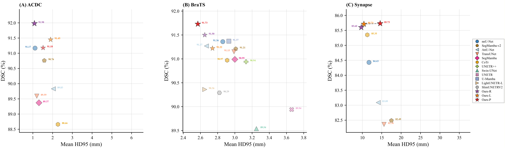
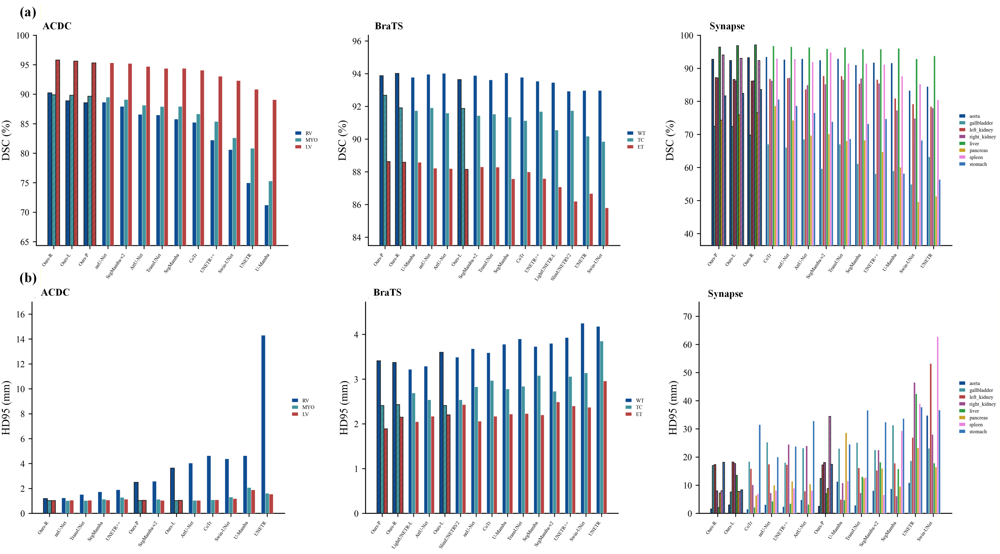
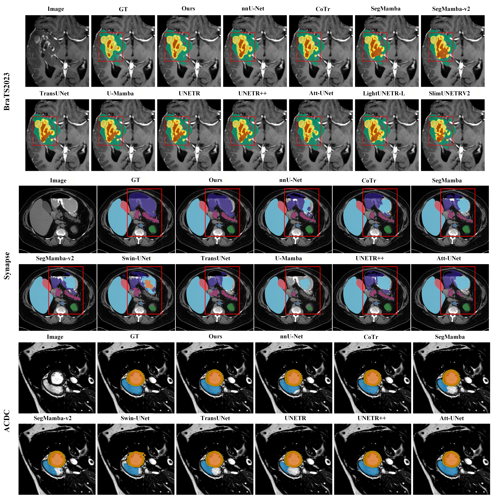
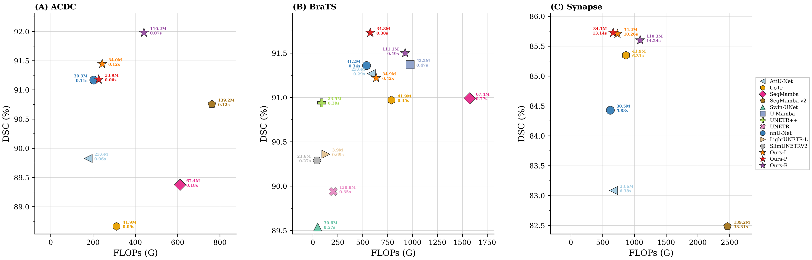
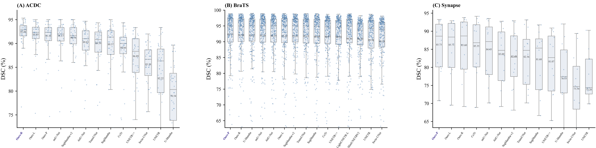
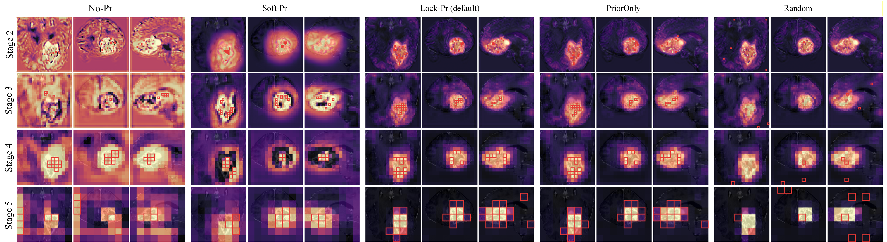
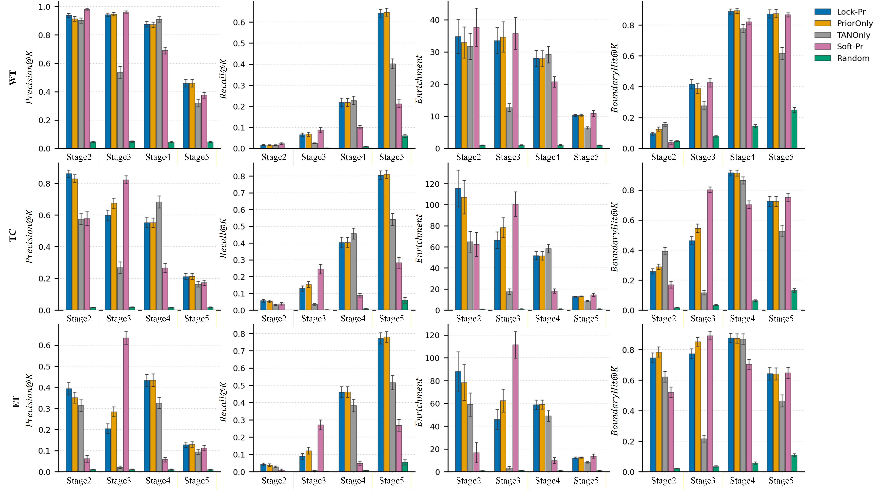

# ✨ SPARK-UNet

**Sparse Prior-guided Attention with Region-aware Key-token sampling** for 3D medical image segmentation — budgeted, anchor-selective multi-source contextual interaction on a dense CNN backbone.

> 💡 **In one line:** prior picks **where to read**, Top-K caps **how many**, BA **writes back** cross-source context at anchors — unselected voxels stay identical.

[中文 README](README.md)

SPARK-UNet targets **3D medical segmentation**: on an nnU-Net-style dense U-Net trunk it injects long-range context via **prior-guided sparse reading (where-to-read)** and **budgeted anchor write-back (BA)**, instead of global self-attention over the full grid. Unselected voxels keep the CNN base unchanged, preserving dense outputs and sliding-window inference.

| Variant | Trainer (`-tr`) | Backbone | Legend |
|:-------:|:----------------|:---------|:-------|
| **P** ⭐ | `nnUNetTrainerSPARKUNetP` | PlainConv | **Ours-P** (primary cross-dataset) |
| **L** | `nnUNetTrainerSPARKUNetL` | LightRes | **Ours-L** |
| **R** | `nnUNetTrainerSPARKUNetR` | ResEnc | **Ours-R** (ACDC emphasis) |

| Loss | Epochs |
|:-----|:-------|
| `L_seg + 0.05·L_prior + 0.02·PriorAux` | ACDC **200**; BraTS / Synapse **1000** (250 it/ep, SGD `1e-2`) |

⚠️ Set **200** epochs for ACDC.

---

## 📖 Overview

**Motivation.** In brain, cardiac, and abdominal multi-organ tasks, foreground often occupies a small fraction of the volume, yet CNN receptive fields struggle with cross-region dependencies while global Transformers incur quadratic cost. SPARK-UNet **first decides where to look**, then aggregates **multi-source context only at Top-K anchors** under a fixed budget.

**Three-step pipeline (Fig. 1b SPARKUnit):**

1. **Orient (E0)** — AxialDW3D for axis-aligned local orientation; no Read/Win on the shallowest stage.
2. **Prior + Top-K (E1–E4)** — PriorHead + energy map → P_eff; TAN picks Top-K on oriented **h** → refined **base**.
3. **BA ∥ Win (E1–E4)** — **BA (Read)** gathers multi-source KV at anchors only, softmax over source dim \(S\), writes back to **base** (BaOnBase); **WinMHSA3D** applies dual-shift window MHSA on **h** and adds to the BA output via a gate (**parallel** to BA, not upstream of it).

Decoder uses **AG (attention gates)** on skips.

**Variants:** **Ours-P** (PlainConv, primary reporting) · **Ours-L** (LightRes) · **Ours-R** (ResEnc-L, best ACDC Mean Dice). Ablation and baseline comparisons are in the manuscript **Tables 5a–5c**.

**This package:** `network.py` · `config.py` · `build_sparkunet` (`__init__.py`); use the `-tr` flags above for P / L / R training and inference.

---

## 🏗️ 1. Architecture (Fig. 1)

Default depth **pool=P5 → encoder stages=S6** (6 encoder stages E0–E5, 5 poolings). Paper **Stages 1–6** map to code **E0–E5**:

| Paper Stage | Code | Modules | Notes |
|:-----------:|:----:|:--------|:------|
| 1 | **E0** | Orient-only | AxialDW3D; no Prior / Read / Win |
| 2–5 | **E1–E4** | Full SPARKUnit | Orient **h** → PriorHead → TAN Top-K → **BA write-back(base)** ∥ **WinMHSA3D(h)** |
| 6 | **E5** | CNN + PriorHead | Deepest CNN + prior head; **no Bottleneck BA** |
| Dec | Decoder | SPARKDecoder + **AG** | Gated skip fusion |

**Module glossary:** **PriorHead** voxel prior (inside E1–E4 units; separate E5 head for training loss); **TAN** tri-view Top-K; **BA** anchor multi-source KV + scatter write-back; **WinMHSA3D** gated in parallel on **h**; **AG** decoder attention gate.

<p align="center">
  
</p>

<p align="center"><sub>
<strong>Fig. 1</strong> SPARK-UNet overview. (a) Full framework; (b) SPARKUnit; (c) AxialDW3D; (d) PriorHead; (e) TAN; (f) BA; (g) WinMHSA3D; (h) Decoder with AG.
</sub></p>

---

## 🚀 2. Setup, training & inference

**Requirements:** nnU-Net v2 runtime (`pip install -e .`), CUDA GPU; datasets in standard nnU-Net folders.

| Path | Role |
|:-----|:-----|
| `network.py` | `SPARKUNet` / `SPARKUnit` / `build_sparkunet` |
| `config.py` | Default network topology and training hyperparameters |
| `assets/` | Paper Figs 1–8 and table CSVs |

```bash
pip install -e .
export nnUNet_raw=/path/to/nnUNet_raw
export nnUNet_preprocessed=/path/to/nnUNet_preprocessed
export nnUNet_results=/path/to/nnUNet_results

nnUNetv2_plan_and_preprocess -d DATASET_ID --verify_dataset_integrity
nnUNetv2_train DATASET_ID 3d_fullres FOLD -tr nnUNetTrainerSPARKUNetP   # or L / R
nnUNetv2_predict -i PATH/imagesTs -o PATH/pred -d DATASET_ID -c 3d_fullres -f all \
  -tr nnUNetTrainerSPARKUNetP -chk checkpoint_final.pth   # match training variant (P / L / R)
```

Loss: **`L_seg + 0.05·L_prior + 0.02·PriorAux`** (SGD `lr=1e-2`, 250 train / 50 val iters per epoch). BraTS / Synapse **1000 epochs**; ACDC **200 epochs**.

---

## 📊 3. Experimental setup & paper results (Figs 2–8 · Tables 2–6)

**Evaluation protocol (manuscript §4.2):** one **full training run** per model to the prescribed epoch count; endpoint Mean Dice / HD95 on **fixed held-out test splits** — **no** validation checkpoint cherry-picking. FLOPs / Latency / Mem measured on RTX 4090 per **dataset plans patch** and **imagesTs sliding-window whole-case** inference (fp32, no TTA).

**Held-out test sizes:**

| Dataset | Modality / task | Held-out test | Split (paper) |
|:--------|:----------------|:--------------|:--------------|
| 🫀 **ACDC** | Short-axis cardiac MRI · RV / MYO / LV | **40 volumes** | 100 patients × ED/ES → 200 volumes; patient-level **70/10/20** → **40 test volumes** (~20 patients) |
| 🧠 **BraTS2023-GLI** | Multimodal brain MRI · WT / TC / ET | **251 cases** | 1251 labeled cases; patient-level **7:1:2** → 875 / 125 / **251** |
| **Synapse (BTCV)** | Portal-phase **abdominal multi-organ CT** · **8 organs**<br>aorta · gallbladder · L/R kidney · liver · pancreas · spleen · stomach | **12 cases** | 30 BTCV cases total; TransUNet split **18 train / 12 held-out test** |

**Headline results:** **Ours-P** vs Plain nnU-Net Mean Dice **+0.01 / +0.37 / +1.30** (ACDC / BraTS / Synapse) at **~+11% Params** and **+7–11% FLOPs** (Table B). BraTS gains concentrate on **TC & ET**; Synapse improves **small organs (e.g. gallbladder)** and HD95; **Ours-R** reaches **91.98** on ACDC. Figs 7–8 diagnose prior / Top-K selection on BraTS held-out (n=251).

📎 CSV sources: [`table_summary.csv`](assets/table_summary.csv) (Table A) · [`table6_efficiency.csv`](assets/table6_efficiency.csv) (Table B)

### 3.0 Performance tables (overview)

#### 📋 Table A · Mean Dice (%↑) on three benchmarks

Matches the manuscript summary; `—` = not evaluated. **Ours-P/L/R** and **nnU-Net** in bold.

| Model | Params (M) | ACDC | BraTS | Synapse |
|:------|----------:|-----:|------:|--------:|
| **Ours-P** ⭐ | 34.80 | 91.18 | **91.73** | **85.73** |
| **Ours-L** | 34.95 | 91.45 | 91.22 | 85.71 |
| **Ours-R** | 111.06 | **91.98** | 91.50 | 85.60 |
| **nnU-Net** | 31.20 | 91.17 | 91.36 | 84.43 |
| AttU-Net | 23.63 | 89.83 | 91.27 | 83.09 |
| CoTr | 41.93 | 88.66 | 90.97 | 85.35 |
| SegMamba | 66.90 | 89.37 | 90.99 | 81.68 |
| SegMamba-v2 | 138.78 | 90.76 | 91.21 | 82.49 |
| Swin-UNet | 30.64 | 85.18 | 89.54 | 73.54 |
| TransUNet | 113.26 | 89.59 | 91.15 | 82.36 |
| U-Mamba | 42.12 | 78.54 | 91.37 | 76.35 |
| UNETR | 130.79 | 82.22 | 89.94 | 73.28 |
| UNETR++ | 23.54 | 86.89 | 90.94 | 81.07 |
| LightUNETR-L | 3.93 | — | 90.36 | — |
| SlimUNETRV2 | 23.61 | — | 90.29 | — |

#### ⚙️ Table B · FLOPs / Latency / memory (Table 6 excerpt, per dataset)

RTX 4090. **FLOPs (G)** = plans-patch forward; **Latency (s)** = imagesTs sliding-window mean (fp32, no TTA); **Mem T / I (GB)** = train peak / infer-patch peak (PyTorch allocated). Excerpt for **Ours-P/L/R** and **nnU-Net**; full 15-method Table 6 is in the manuscript.

| Model | Params (M) | ACDC FLOPs | ACDC Lat | ACDC Mem T/I | BraTS FLOPs | BraTS Lat | BraTS Mem T/I | Synapse FLOPs | Synapse Lat | Synapse Mem T/I |
|:------|----------:|-----------:|---------:|-------------:|------------:|----------:|--------------:|--------------:|------------:|----------------:|
| **Ours-P** | 34.80 | 226.7 | 0.062 | 12.4 / 0.8 | 575.1 | 0.377 | 9.4 / 1.7 | 664.7 | 13.143 | 13.0 / 2.6 |
| **Ours-L** | 34.95 | 243.1 | 0.120 | 13.7 / 0.9 | 634.1 | 0.418 | 10.8 / 2.0 | 732.5 | 10.260 | 12.3 / 2.0 |
| **Ours-R** | 111.06 | 440.4 | 0.071 | 15.0 / 1.2 | 925.5 | 0.487 | 11.5 / 2.1 | 1089.4 | 14.239 | 13.6 / 2.6 |
| **nnU-Net** | 31.20 | 203.4 | 0.111 | 6.2 / 0.6 | 538.1 | 0.340 | 6.2 / 1.7 | 619.6 | 5.883 | 7.3 / 2.5 |

Ours-P vs nnU-Net: **Params ~+11%**; FLOPs **+11.4% (ACDC) / +6.9% (BraTS) / +7.3% (Synapse)**; Latency varies by dataset and patch scale.

#### 🎯 Table C · Per-dataset highlights (Tables 2–4)

| Dataset | Table | Ours-P vs nnU-Net | Main takeaway |
|:--------|:------|:------------------|:--------------|
| 🧠 BraTS | 2 | **91.73** vs 91.36 | TC **+0.77**, ET **+0.41**; WT ~flat |
| 🫀 ACDC | 3 | **91.18** vs 91.17 | Ours-P ≈ nnU-Net; **Ours-R 91.98** |
| Synapse (BTCV) | 4 | **85.73** vs 84.43 | 8 abdominal organs; gallbladder **72.47** vs 66.09 |

---

### 3.1 📈 Fig. 2 · Dice–HD95 Pareto

Fig. 2 jointly plots Mean DSC and Mean HD95; dashed Pareto fronts summarize accuracy–boundary trade-offs across method clusters.

<p align="center"></p>

<sub><strong>Fig. 2</strong> Mean DSC (↑) vs Mean HD95 (↓, mm); dashed Pareto fronts. Left ACDC · middle BraTS · right Synapse.</sub>

### 3.2 📈 Fig. 3 · Per-region Dice / HD95

<p align="center"></p>

<sub><strong>Fig. 3</strong> (a) region DSC; (b) region HD95. ACDC: RV/MYO/LV; BraTS: WT/TC/ET; Synapse (BTCV): 8 abdominal organs.</sub>

### 3.3 🖼️ Fig. 4 · Qualitative segmentation

<p align="center"></p>

<sub><strong>Fig. 4</strong> Ours-P on BraTS/Synapse, Ours-R on ACDC; GT vs prediction overlays.</sub>

### 3.4 ⚖️ Fig. 5 · FLOPs–DSC (Table 6)

<p align="center"></p>

<p align="center"><sub><strong>Fig. 5</strong> FLOPs–DSC trade-off (★ Ours-P/L/R). Three panels: ACDC / BraTS / Synapse. See <strong>Table B</strong>.</sub></p>

### 3.5 📦 Fig. 6 · Case-level Mean Dice

<p align="center"></p>

<sub><strong>Fig. 6</strong> Per-case Mean Dice (strip + box). Top labels = same Mean Dice as Tables 2–4.</sub>

### 3.6 🎯 Fig. 7 · Prior / Top-K visualization (BraTS)

Fig. 7 is a **where-to-read** diagnostic: one BraTS case comparing Lock-Pr / PriorOnly / Random etc.; red boxes mark tri-view Top-K anchors.

<p align="center"></p>

<p align="center"><sub><strong>Fig. 7</strong> Single-case where-to-read; Stages 2–5; Lock-Pr / PriorOnly / Random / …; Top-K (red boxes).</sub></p>

### 3.7 🔬 Fig. 8 · Full held-out selection quality (BraTS)

Fig. 8 aggregates Precision@K, Recall@K, Enrichment, and BoundaryHit@K over **251 held-out cases** (Stages 2–5; mean ± 95% CI), quantifying whether priors land on foreground / boundaries.

<p align="center"></p>

<p align="center"><sub><strong>Fig. 8</strong> Selection quality (n=251; Stages 2–5): Precision@K, Recall@K, Enrichment, BoundaryHit@K; mean ± 95% CI.</sub></p>

🧪 Ablation Tables 5a–5c are in the manuscript only.

---

## 📜 4. License

SPARK-UNet module code is released under the **[Apache License 2.0](LICENSE.txt)**.

- Implementation in this `sparkunet/` directory: see [`LICENSE.txt`](LICENSE.txt)
- Training/inference builds on [nnU-Net](https://github.com/MIC-DKFZ/nnUNet) and its license
- Public benchmarks (ACDC, BraTS2023-GLI, Synapse/BTCV) remain subject to their original data-use terms
